# Stransfer

Stransfer is a progressive web application that lets you take pictures and apply a style to them. It was made by students as part of a college project using the ml5js library :books:.

## Features
* You can take photos within the app and apply astonishing styles to them
* You can also upload images from your device
* Everything is done in your browser, your photos never leave your device
* You can use the app offline

## Considerations
* Once you click on a style it will be downloaded. They are about 17MB each 😱 but after the first download they are stored in browser for later use (including offline use)
* The computation needed is considerably high and the app will freeze or lag until the style is applied
* Doesn't work on Safari nor iOS 😔
* For performance reasons the style is not displayed on the camera in real time
* For performance reasons too the size of the photos is considerably low

## Other implementations
Besides the web app, we also created two jupyter notebooks related to Style Transfer techniques:

* [Implementation Gatys et al.](https://github.com/carlosdg/NeuralStyleTransfer)
* [Training style transfer for ml5](https://github.com/carlosdg/TrainStyleTransfer)

## Results

| Content | Style | Result |
|:-------:|:------|:-------|
|    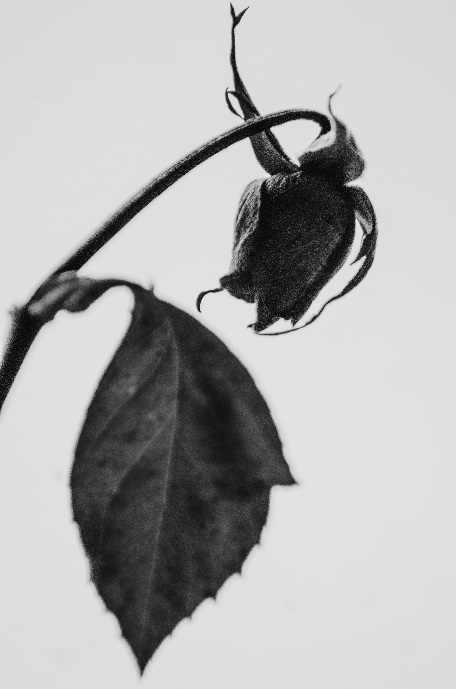 | 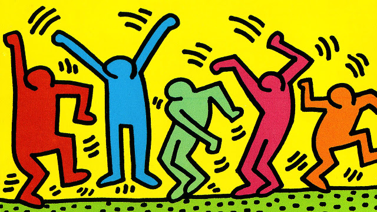 | 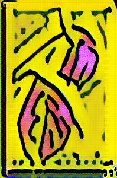 |
| 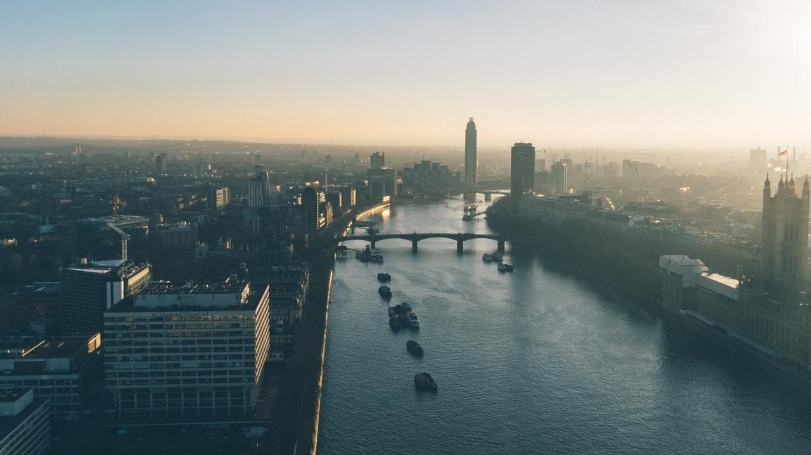 | 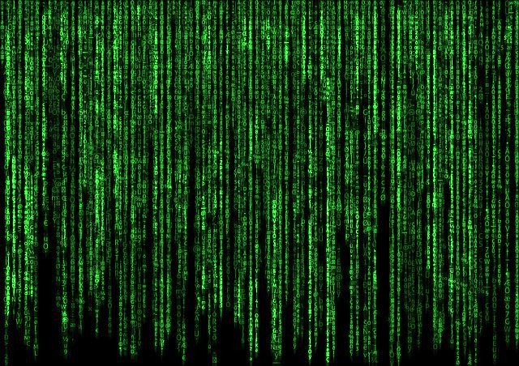 | 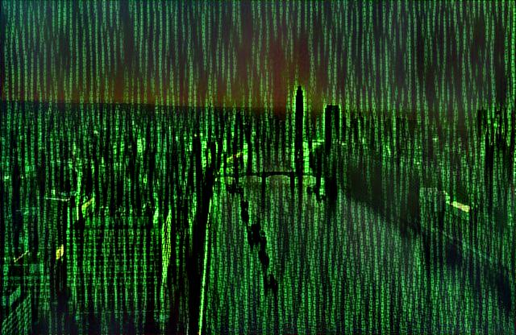 |
| 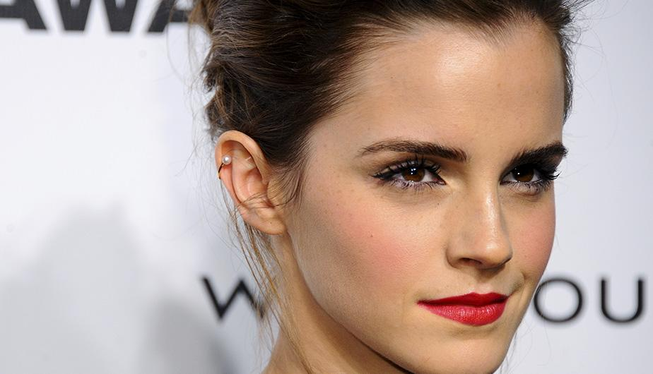 | 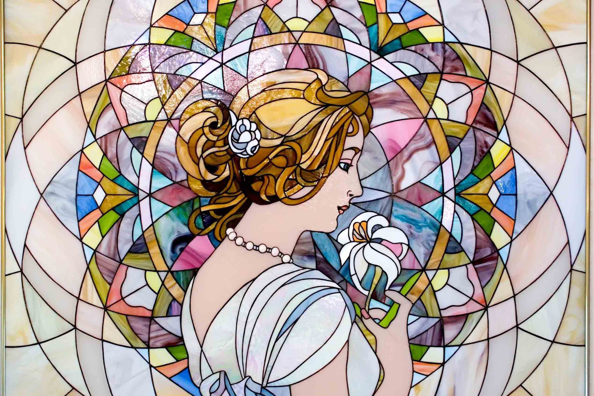 | 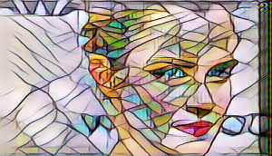 |
| 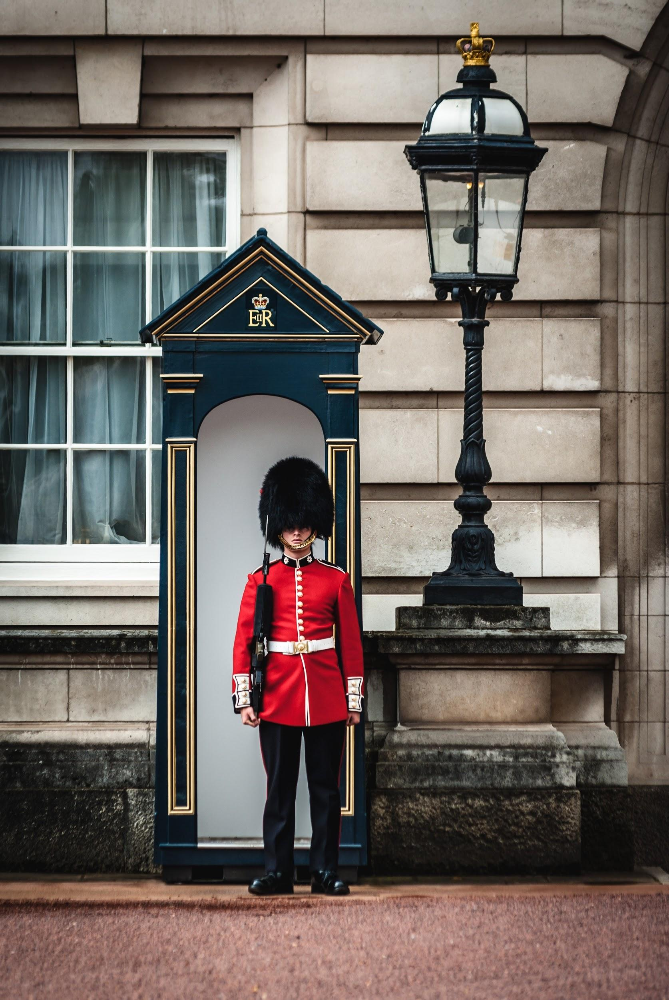 | 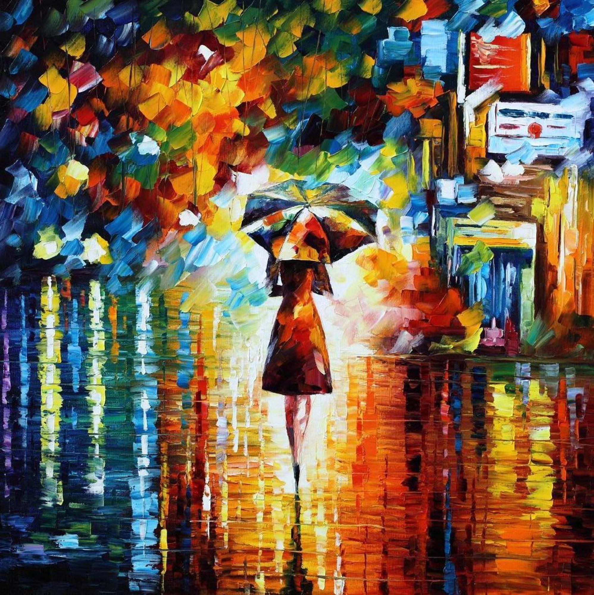 | 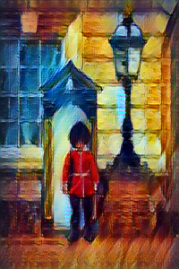|
| 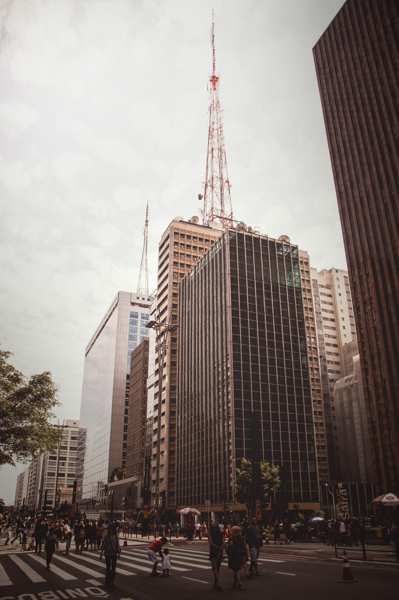 | 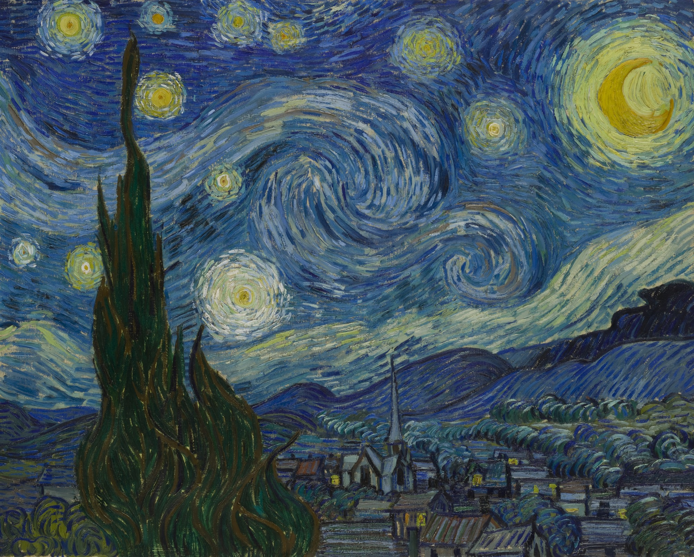 | 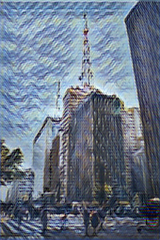 |
| 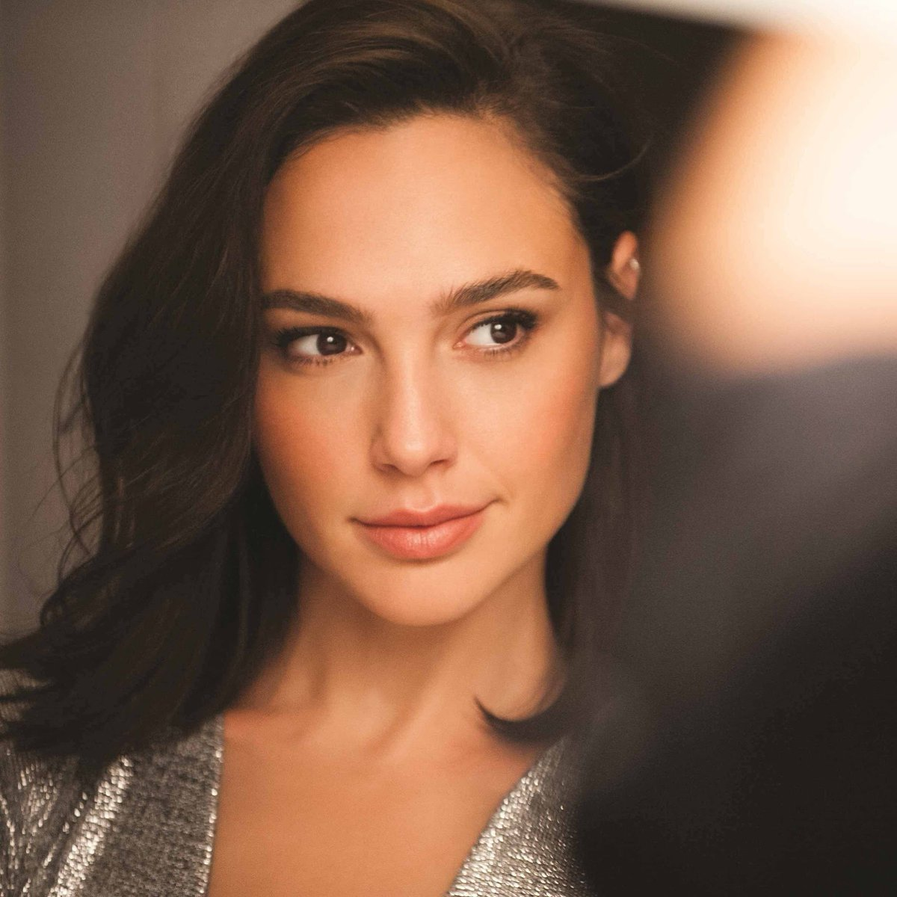 |  |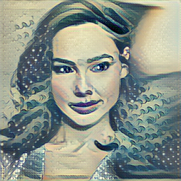 |

## Authors

* Carlos Domínguez García ([carlosdg](https://github.com/carlosdg))
* Daute Rodríguez Rodríguez ([DauteRR](https://github.com/DauteRR))
